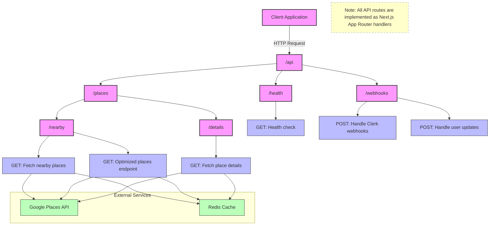
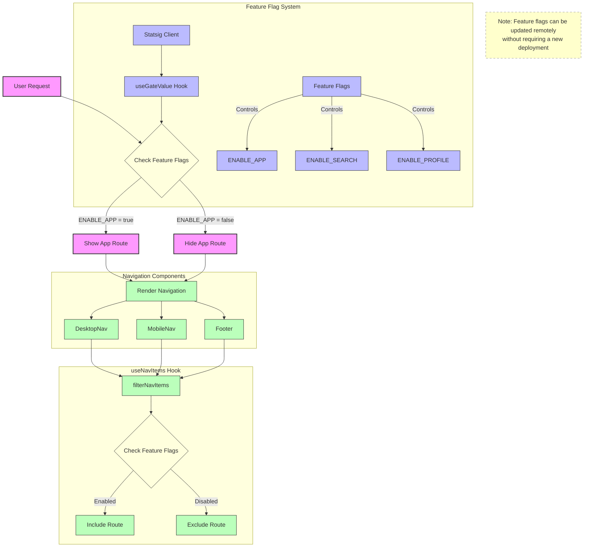
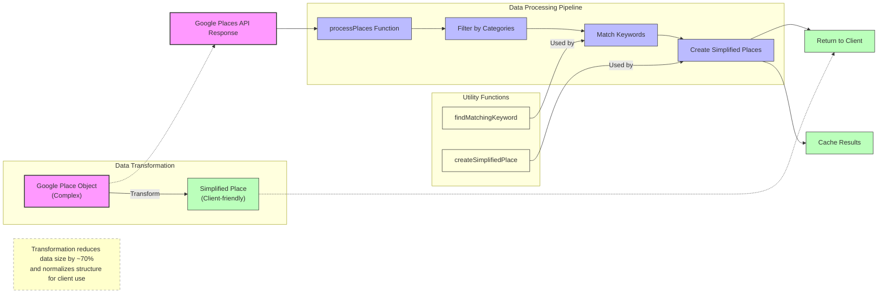
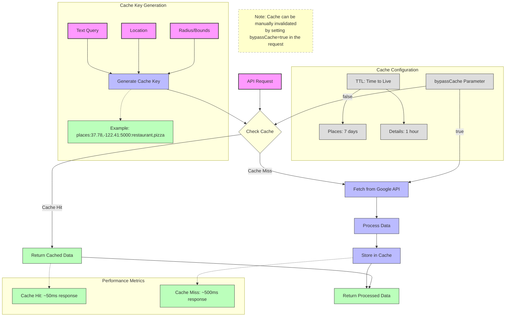
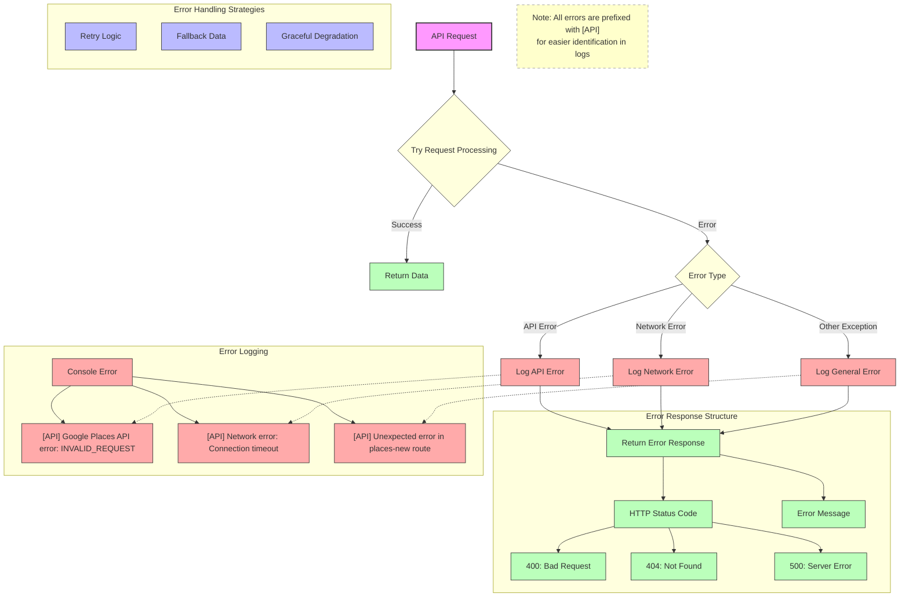

# Emoji Map Web App

<div align="center">
  <p align="center">
    
  </p>
  <h3 align="center" style="margin-bottom: 20px;">Find places on a map with emoji markers</h3>
  
  <div style="margin-top: 20px;">
    <a href="https://github.com/sotomaque/emoji-map-next" style="margin: 0 10px;">
      
    </a>
    <a href="https://github.com/sotomaque/emoji-map" style="margin: 0 10px;">
      
    </a>
  </div>
</div>

A Next.js web application that displays places on a map using emoji markers. This web app is the companion to the [iOS Emoji Map app](https://github.com/sotomaque/emoji-map), providing the same functionality in a web interface. Both applications connect to our Next.js backend, which interfaces with the Google Places API and provides data through a shared services layer.

## Features

- 🗺️ Interactive Google Maps integration with custom emoji markers
- 🍔 Category-based place search with emoji markers
- 🔍 Search for places near your current location
- ⭐ View place details including ratings, photos, and reviews
- 🌙 Dark mode support
- 📱 Responsive design for mobile and desktop
- 📄 Simple API documentation
- 🔄 State management with Zustand for filters and preferences
- 📊 Marker clustering for improved map performance
- 🧪 Comprehensive test suite with 95%+ coverage
- 🚀 Redis caching for improved API performance
- 🔐 User authentication with Clerk
- 🗄️ PostgreSQL database with Prisma ORM
- 🔄 Git hooks with Husky for code quality checks
- 🚦 Feature flags with Statsig

### Data Flow

1. **User Interaction**: User interacts with the frontend to search for places or manage their account
2. **Authentication**:
   - User authenticates directly with Clerk from the frontend
   - Clerk provides authentication tokens to the frontend
3. **API Requests**:
   - Frontend makes requests to the Next.js backend API
   - Backend validates authentication with Clerk
4. **Places Data Flow**:
   - Place-related requests go to the `/api/places` routes
   - These routes check Redis cache for existing data
   - If data is not in cache, Redis fetches from Google Places API
   - Responses are cached in Redis for future requests
   - Data is returned to the frontend for display
5. **User Data Flow**:
   - User data is stored in Supabase PostgreSQL
   - When user data changes, Clerk sends webhook events to the backend
   - Backend processes webhook events and updates Supabase via Prisma

## Tech Stack

- [Next.js 15](https://nextjs.org/) - React framework
- [TypeScript](https://www.typescriptlang.org/) - Type safety
- [Google Maps API](https://developers.google.com/maps) - Maps and location services
- [Google Places API](https://developers.google.com/maps/documentation/places/web-service) - Place data
- [Tailwind CSS](https://tailwindcss.com/) - Styling
- [Zustand](https://github.com/pmndrs/zustand) - State management
- [@react-google-maps/api](https://github.com/JustFly1984/react-google-maps-api) - Google Maps React components
- [@t3-oss/env-nextjs](https://github.com/t3-oss/env-nextjs) - Type-safe environment variables
- [Vitest](https://vitest.dev/) - Testing framework
- [MSW](https://mswjs.io/) - API mocking for tests
- [React Query](https://tanstack.com/query/latest) - Data fetching and caching
- [Upstash Redis](https://upstash.com/) - Serverless Redis for caching
- [Supabase](https://supabase.com/) - PostgreSQL database
- [Prisma](https://www.prisma.io/) - ORM for database access
- [Clerk](https://clerk.com/) - User authentication
- [Husky](https://typicode.github.io/husky/) - Git hooks for code quality
- [Statsig](https://statsig.com/) - Feature flags and experimentation

## Getting Started

### Environment Variables

Create a `.env.local` file in the root of the web directory with the following variables:

```
# Site Environment
NEXT_PUBLIC_SITE_URL=http://localhost:3000
NEXT_PUBLIC_SITE_ENV=development

# Google Places API
GOOGLE_PLACES_API_KEY=your_api_key_here
NEXT_PUBLIC_GOOGLE_MAPS_API_KEY=your_api_key_here

# Google Places API URLs
GOOGLE_PLACES_URL=https://maps.googleapis.com/maps/api/place/nearbysearch/json
GOOGLE_PLACES_V2_URL=https://places.googleapis.com/v1/places:searchText
GOOGLE_PLACES_DETAILS_URL=https://maps.googleapis.com/maps/api/place/details/json
GOOGLE_PLACES_PHOTO_URL=https://maps.googleapis.com/maps/api/place/photo

# Clerk Authentication
NEXT_PUBLIC_CLERK_PUBLISHABLE_KEY=your_clerk_publishable_key
CLERK_SECRET_KEY=your_clerk_secret_key
CLERK_SIGNING_SECRET=your_clerk_signing_secret

# Database - Supabase
POSTGRES_URL=your_postgres_url
POSTGRES_PRISMA_URL=your_postgres_prisma_url
SUPABASE_URL=your_supabase_url
NEXT_PUBLIC_SUPABASE_URL=your_supabase_url
POSTGRES_URL_NON_POOLING=your_postgres_url_non_pooling
SUPABASE_JWT_SECRET=your_supabase_jwt_secret
POSTGRES_USER=your_postgres_user
NEXT_PUBLIC_SUPABASE_ANON_KEY=your_supabase_anon_key
POSTGRES_PASSWORD=your_postgres_password

# Upstash Redis (for caching)
KV_URL=your_upstash_redis_url
KV_REST_API_READ_ONLY_TOKEN=your_upstash_read_only_token
KV_REST_API_TOKEN=your_upstash_redis_token
KV_REST_API_URL=your_upstash_redis_url

# Statsig (Feature Flags)
EXPERIMENTATION_CONFIG_ITEM_KEY=your_statsig_config_key
NEXT_PUBLIC_STATSIG_CLIENT_KEY=your_statsig_client_key
STATSIG_SERVER_API_KEY=your_statsig_server_key
```

### Type-Safe Environment Variables

This project uses `@t3-oss/env-nextjs` for type-safe environment variables. Instead of directly accessing `process.env`, we use our custom environment helper located in `src/env.ts`:

```typescript
import { env } from '~/env';

// Type-safe access to environment variables
const apiKey = env.GOOGLE_PLACES_API_KEY;
```

This provides:

- Type safety for environment variables
- Runtime validation with Zod
- Better error messages when environment variables are missing
- Consistent access pattern across components

### Available Scripts

```bash
# Development
pnpm dev           # Start the development server
pnpm build         # Build the application for production
pnpm start         # Start the production server
pnpm postinstall   # Generate Prisma client (runs automatically after install)
pnpm prepare       # Set up Husky git hooks (runs automatically after install)

# Code Quality
pnpm lint          # Run ESLint to check for issues
pnpm lint:fix      # Run ESLint and automatically fix issues
pnpm format        # Run Prettier to format all files
pnpm format:check  # Check if files are properly formatted
pnpm precheck      # Run format, lint:fix, and type checking

# Testing
pnpm test          # Run all tests
pnpm test:watch    # Run tests in watch mode
pnpm test:ui       # Run tests with UI
pnpm test:coverage # Run tests with coverage report

# Database
pnpm db:generate   # Generate Prisma client
pnpm db:push       # Push schema changes to the database
pnpm db:studio     # Open Prisma Studio to manage the database
pnpm db:seed       # Seed the database with initial data
```

## Git Hooks

This project uses Husky to manage Git hooks for ensuring code quality. The following hooks are configured:

### pre-push

The `pre-push` hook runs before pushing changes to the remote repository and performs the following checks:

1. **Precheck**: Runs formatting, linting, type checking, and tests to ensure code quality.
2. **Build**: Builds the project to ensure it compiles successfully.

If any of these checks fail, the push will be aborted, and you'll need to fix the issues before pushing again.

To bypass the hooks in rare cases (not recommended), you can use:

```bash
git push --no-verify
```

For more information about the Git hooks, see the [.husky/README.md](.husky/README.md) file.

## Navigation System

The application uses a robust navigation system with active state detection for highlighting the current section in the navigation menu.

### Active State Detection

The navigation system includes a utility function `isNavItemActive` that determines whether a navigation item should be highlighted based on the current path:

```typescript
export function isNavItemActive(href: string, path: string | null | undefined) {
  // Handle null or undefined path
  if (!path) {
    return href === '/';
  }
  return href === '/' ? path === '/' : path.startsWith(href);
}
```

This function:

- Handles null or undefined paths by defaulting to the home page
- For the home page (`/`), only returns true if the path is exactly `/`
- For other pages, returns true if the current path starts with the navigation item's href

This approach ensures that navigation items are correctly highlighted even in nested routes and handles edge cases like null paths that might occur during hydration.

## API Documentation

API documentation is currently under development. A simple version of the API docs will be available at:

```
http://localhost:3000/api-docs
```

The documentation will provide details about available endpoints, request formats, and response structures.

## API Routes

### `/api/places/nearby`

Fetches nearby places based on location and category.

**Parameters:**

- `location` (required): Latitude and longitude in format "lat,lng"
- `radius` (optional): Search radius in meters (default: 5000)
- `bounds` (optional): Bounds in format "lat1,lng1|lat2,lng2"
- `type` (required): Google Places type (e.g., "restaurant", "cafe")
- `keywords` (optional): Comma-separated list of keywords to search for
- `openNow` (optional): Set to "true" to only show places that are currently open

**Example:**

```
/api/places/nearby?location=37.7749,-122.4194&radius=5000&type=restaurant&keywords=burger,pizza&openNow=true
```

**Backend Processing:**

1. The request is received by the Next.js API route
2. The route checks Redis for a cached response
3. If no cache exists, Redis makes a request to Google Places API
4. The response is cached in Redis for future requests
5. The data is returned to the client

**Caching:**

This endpoint implements Redis caching to improve performance and reduce API calls to Google Places:

- Results are cached based on location and radius
- Coordinates are rounded to 2 decimal places (~1.11km precision)
- Radius values are normalized to reduce unique cache keys
- Cache entries expire after 7 days

### `/api/places/details`

Fetches details for a specific place.

**Parameters:**

- `placeId` (required): The Google Places ID of the place

**Example:**

```
/api/places/details?placeId=ChIJN1t_tDeuEmsRUsoyG83frY4
```

**Caching:**

This endpoint implements Redis caching to improve performance and reduce API calls to Google Places:

- Results are cached based on placeId
- Cache entries expire after 1 hour
- The response includes a `source` field indicating whether the data came from the cache or the API

### `/api/webhooks`

Webhook endpoint for Clerk authentication events.

**Purpose:**

- Receives webhook events from Clerk when user data changes
- Synchronizes user data with the Supabase PostgreSQL database via Prisma
- Handles user creation, updates, and deletion events

**Flow:**

1. Clerk detects a change in user data (signup, profile update, deletion)
2. Clerk sends a webhook event to the `/api/webhooks` endpoint
3. The endpoint validates the webhook signature using Clerk's signing secret
4. The webhook payload is processed based on the event type
5. User data is synchronized with Supabase using Prisma ORM
6. A success response is returned to Clerk

**Security:**

- Validates webhook requests using Clerk's signing secret
- Rejects requests without valid Svix headers
- Uses environment variables for secure configuration

**Event Types:**

- `user.created`: A new user has signed up
- `user.updated`: A user has updated their profile
- `user.deleted`: A user has been deleted

**Example Webhook Processing:**

```typescript
// Simplified example of webhook processing
export async function POST(req: Request) {
  // Validate webhook signature
  const payload = await validateWebhookSignature(req);

  // Process based on event type
  switch (payload.type) {
    case 'user.created':
      await prisma.user.create({
        data: {
          id: payload.data.id,
          email: payload.data.email_addresses[0]?.email_address,
          name: payload.data.first_name,
        },
      });
      break;
    case 'user.updated':
      // Update user in database
      break;
    case 'user.deleted':
      // Delete user from database
      break;
  }

  return new Response('Webhook processed', { status: 200 });
}
```

## API Architecture Diagrams

The following diagrams provide a visual representation of the API architecture and data flow in the application. These diagrams are created using [Mermaid](https://mermaid.js.org/), a JavaScript-based diagramming and charting tool that renders Markdown-inspired text definitions to create diagrams dynamically.

### API Structure

This diagram shows the overall structure of the API endpoints and their relationships:



### Places API Flow

This sequence diagram illustrates the data flow when fetching places from the API:

```mermaid
sequenceDiagram
    %% Places API Flow Diagram
    %% Shows the sequence of operations when fetching places

    %% Define participants with styling
    participant Client as 🌐 Client
    participant API as 🔄 Next.js API Route
    participant Cache as 💾 Redis Cache
    participant Google as 🔍 Google Places API

    %% Add styling
    autonumber

    %% Request flow
    Client->>+API: GET /api/places/nearby/places-new
    Note over API: Process request parameters<br/>(location, radius, keywords)

    %% Cache check
    API->>+Cache: Check cache for results

    %% Conditional flow based on cache
    alt Cache hit
        Cache-->>-API: Return cached results
        API-->>-Client: Return processed places (from cache)
        Note right of Client: Fast response (< 100ms)
    else Cache miss
        Cache-->>-API: No cached data
        API->>+Google: Fetch from Google Places API
        Note over Google: Search for places<br/>based on parameters
        Google-->>-API: Return places data

        rect rgb(240, 248, 255)
            Note over API: Data Processing
            API->>API: Process places with utility functions
            Note over API: findMatchingKeyword()<br/>createSimplifiedPlace()
        end

        API->>Cache: Store results in cache (TTL: 7 days)
        API-->>-Client: Return processed places (from API)
        Note right of Client: Slower response (300-800ms)
    end

    %% Add a note about caching
    Note over Cache: Cache key format:<br/>places:{location}:{radius}:{keywords}
```

### Feature Flag System

This diagram shows how feature flags are implemented in the application:



### Places Data Processing

This flowchart illustrates how place data is processed:



### Caching System

This diagram shows how the caching system works:



### Error Handling

This flowchart illustrates the error handling flow:



## Project Structure

```
web/
├── src/
│   ├── app/
│   │   ├── api/
│   │   │   ├── docs/
│   │   │   ├── health/
│   │   │   ├── places/
│   │   │   │   ├── nearby/
│   │   │   │   └── details/
│   │   │   ├── webhooks/
│   │   │   └── docs/
│   │   ├── layout.tsx
│   │   └── page.tsx
│   ├── components/
│   │   ├── map/
│   │   ├── nav/
│   │   ├── ui/
│   │   └── providers/
│   ├── constants/
│   ├── hooks/
│   ├── services/
│   ├── store/
│   ├── lib/
│   ├── utils/
│   ├── __tests__/
│   ├── types/
│   └── env.ts
├── prisma/
│   └── schema.prisma
├── public/
├── .env.local
└── various config files
```

## Architecture

The application follows a modern Next.js architecture with the following key components:

```
┌─────────────────────────────────────────────────────────────────────┐
│                           Client Browser                            │
└───────────────────────────────────┬─────────────────────────────────┘
                                    │
                                    ▼
┌─────────────────────────────────────────────────────────────────────┐
│                           Next.js App Router                        │
├─────────────────┬─────────────────┬────────────────┬────────────────┤
│ React Components│  Zustand Store  │  React Query   │   TailwindCSS  │
└─────────────────┴─────────────────┴────────────────┴────────────────┘
                                    │
                                    ▼
┌─────────────────────────────────────────────────────────────────────┐
│                           Next.js API Routes                        │
├─────────────────┬─────────────────┬────────────────┬────────────────┤
│  /api/places    │  /api/webhooks  │  /api/health   │  /api/docs     │
└─────────────────┴─────────────────┴────────────────┴────────────────┘
                                    │
                 ┌──────────────────┬─────────────────┐
                 │                  │                 │
                 ▼                  ▼                 ▼
┌───────────────────┐   ┌───────────────────┐  ┌───────────────────┐
│ Google Places API │   │   Upstash Redis   │  │  PostgreSQL DB    │
└───────────────────┘   └───────────────────┘  └───────────────────┘
                                                       ▲
                                                       │
                                              ┌───────────────────┐
                                              │  Clerk Auth       │
                                              └───────────────────┘
```

### Frontend

- **React Components**: UI components for the map, markers, and user interface
- **Zustand Store**: Global state management for filters and user preferences
- **React Query**: Data fetching and client-side caching
- **Tailwind CSS**: Utility-first CSS framework for styling

### Backend

- **Next.js API Routes**: Server-side API endpoints

  - `/api/places/nearby`: Fetches nearby places with Redis caching (7-day expiration)
  - `/api/places/details`: Fetches place details with Redis caching (1-hour expiration)
  - `/api/webhooks`: Processes Clerk webhook events for user data synchronization
  - `/api/health`: Health check endpoint for monitoring
  - `/api/docs`: OpenAPI documentation endpoint

- **External Services**:
  - **Google Places API**: Provides location data for places
  - **Upstash Redis**: Serverless Redis for caching API responses
  - **PostgreSQL Database**: Stores user data and other persistent information
  - **Clerk Authentication**: Manages user authentication and profile data

### Data Flow

1. **User Authentication**:

   - User authenticates via Clerk
   - Clerk sends webhook events to `/api/webhooks`
   - User data is synchronized with PostgreSQL database

2. **Place Search**:

   - Client requests nearby places from `/api/places/nearby`
   - API checks Redis cache for matching data
   - If cache hit, returns filtered data from cache
   - If cache miss, fetches from Google Places API and caches the result
   - Results are returned to the client

3. **Place Details**:
   - Client requests place details from `/api/places/details`
   - API checks Redis cache for matching data
   - If cache hit, returns data from cache
   - If cache miss, fetches from Google Places API and caches the result
   - Results are returned to the client

## Database

The application uses PostgreSQL as the database, with Prisma as the ORM. The database schema is defined in `prisma/schema.prisma`.

### Database Schema

The database includes the following models:

- **User**: Stores user information synchronized with Clerk authentication
- **PlaceCache**: Stores cached Google Places API responses

### Migrations

For production environments, it's recommended to use Prisma Migrate to manage database migrations:

```bash
# Create a new migration
npx prisma migrate dev --name <migration-name>

# Apply migrations in production
npx prisma migrate deploy
```

## Authentication

The application uses Clerk for authentication and user management. Clerk provides a complete authentication solution with features like:

- Social login (Google, GitHub, etc.)
- Email/password authentication
- Multi-factor authentication
- User profile management
- Session management

### Authentication Flow

1. Users sign in using Clerk's authentication components in the frontend
2. Clerk issues a JWT token upon successful authentication
3. The token is used to authenticate API requests to the backend
4. User data is synchronized with the Supabase PostgreSQL database via webhooks

### Webhook Integration

When user data changes in Clerk (e.g., a user signs up, updates their profile, or is deleted), Clerk sends webhook events to the application. The application processes these events and updates the Supabase PostgreSQL database accordingly.

Webhook requests are secured using Svix headers, which include:

- `svix-id`: A unique identifier for the webhook event
- `svix-timestamp`: The time the webhook was sent
- `svix-signature`: A signature that verifies the webhook came from Clerk

The webhook endpoint validates these headers using Clerk's signing secret before processing the webhook payload.

## Database Integration

The web app uses Prisma ORM to interact with the Supabase PostgreSQL database. This provides:

1. **Type-safe database access**: Prisma generates TypeScript types based on your schema
2. **Simplified queries**: Prisma Client provides an intuitive API for database operations
3. **Migrations**: Prisma Migrate helps manage database schema changes
4. **Data validation**: Prisma validates data before sending it to the database

### Prisma Schema

The Prisma schema defines the database models and relationships:

```prisma
// Simplified example of Prisma schema
model User {
  id        String   @id
  email     String?  @unique
  name      String?
  createdAt DateTime @default(now())
  updatedAt DateTime @updatedAt
  favorites Place[]
}

model Place {
  id        String   @id
  name      String
  location  Json
  category  String
  users     User[]
  createdAt DateTime @default(now())
  updatedAt DateTime @updatedAt
}
```

### Database Operations

The application uses Prisma Client for database operations:

```typescript
// Example of database operations with Prisma
import { prisma } from '~/lib/prisma';

// Create a user
const user = await prisma.user.create({
  data: {
    id: 'user_123',
    email: 'user@example.com',
    name: 'John Doe',
  },
});

// Add a favorite place for a user
await prisma.place.create({
  data: {
    id: 'place_123',
    name: 'Coffee Shop',
    location: { lat: 37.7749, lng: -122.4194 },
    category: 'cafe',
    users: {
      connect: { id: 'user_123' },
    },
  },
});

// Get a user with their favorite places
const userWithFavorites = await prisma.user.findUnique({
  where: { id: 'user_123' },
  include: { favorites: true },
});
```
