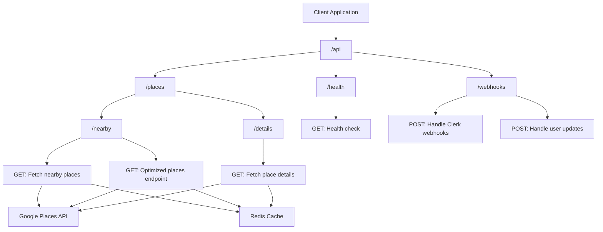
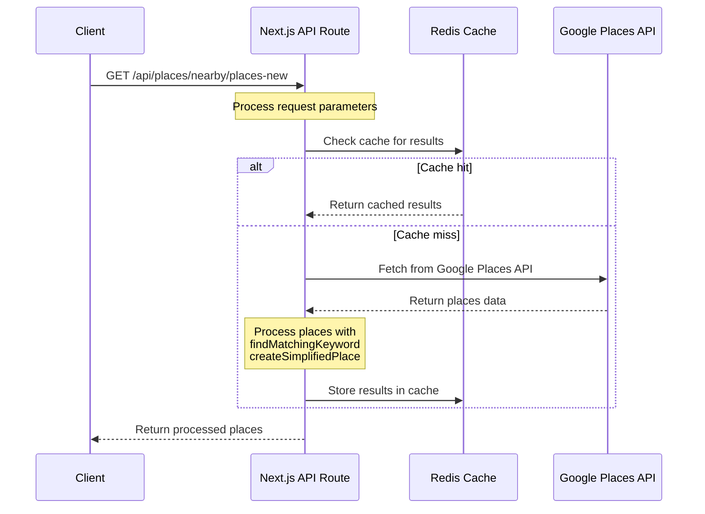
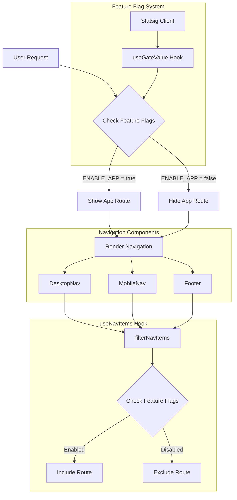
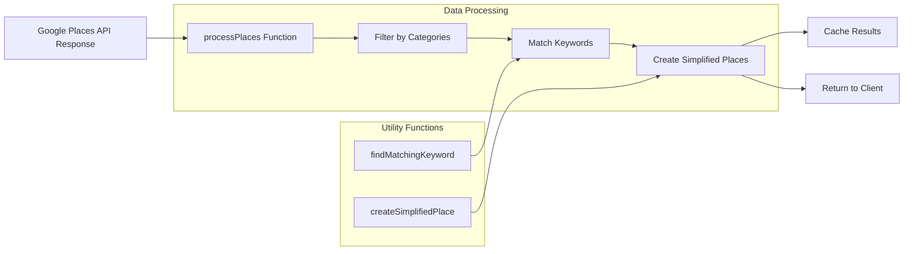
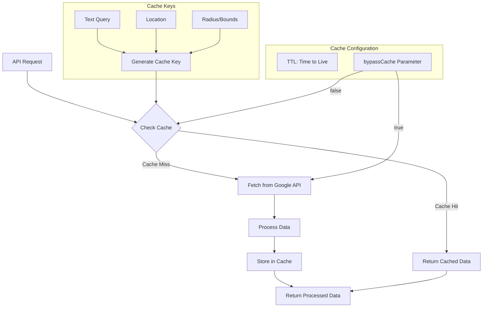
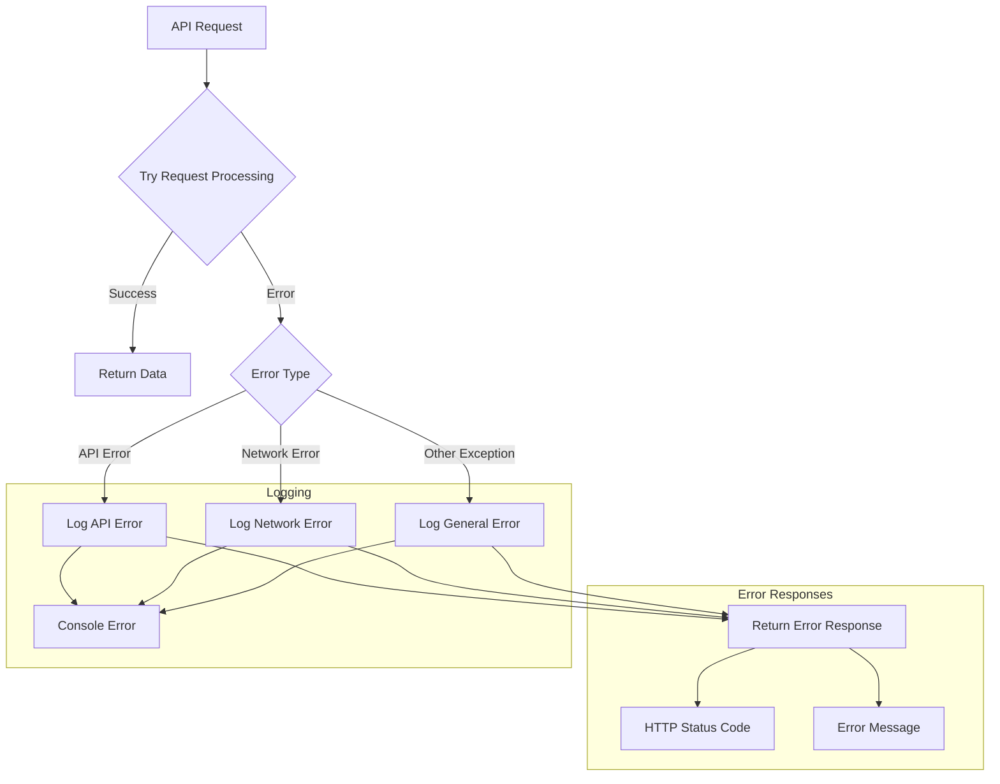

# Emoji Map Web App

<div align="center">
  
  <h3>Find places on a map with emoji markers</h3>
  
  <div style="margin-top: 20px;">
    <a href="https://github.com/sotomaque/emoji-map-next">
      
    </a>
    <a href="https://github.com/sotomaque/emoji-map">
      
    </a>
  </div>
</div>

A Next.js web application that displays places on a map using emoji markers. This web app is the companion to the [iOS Emoji Map app](https://github.com/sotomaque/emoji-map), providing the same functionality in a web interface. Both applications use the Google Places API to fetch location data and display it on an interactive map.

## Features

- 🗺️ Interactive Google Maps integration with custom emoji markers
- 🍔 Category-based place search with emoji markers
- 🔍 Search for places near your current location
- ⭐ View place details including ratings, photos, and reviews
- 🌙 Dark mode support
- 📱 Responsive design for mobile and desktop
- 📚 Interactive API documentation with Swagger UI
- 🔄 State management with Zustand for filters and preferences
- 📊 Marker clustering for improved map performance
- 🧪 Comprehensive test suite with 95%+ coverage
- 🚀 Redis caching for improved API performance
- 🔐 User authentication with Clerk
- 🗄️ PostgreSQL database with Prisma ORM

## Tech Stack

- [Next.js 15](https://nextjs.org/) - React framework
- [TypeScript](https://www.typescriptlang.org/) - Type safety
- [Google Maps API](https://developers.google.com/maps) - Maps and location services
- [Google Places API](https://developers.google.com/maps/documentation/places/web-service) - Place data
- [Tailwind CSS](https://tailwindcss.com/) - Styling
- [Zustand](https://github.com/pmndrs/zustand) - State management
- [@react-google-maps/api](https://github.com/JustFly1984/react-google-maps-api) - Google Maps React components
- [@t3-oss/env-nextjs](https://github.com/t3-oss/env-nextjs) - Type-safe environment variables
- [next-swagger-doc](https://github.com/atomicpages/next-swagger-doc) - OpenAPI documentation
- [Swagger UI](https://swagger.io/tools/swagger-ui/) - Interactive API documentation
- [Vitest](https://vitest.dev/) - Testing framework
- [MSW](https://mswjs.io/) - API mocking for tests
- [React Query](https://tanstack.com/query/latest) - Data fetching and caching
- [Upstash Redis](https://upstash.com/) - Serverless Redis for caching
- [Supabase](https://supabase.com/) - PostgreSQL database
- [Prisma](https://www.prisma.io/) - ORM for database access
- [Clerk](https://clerk.com/) - User authentication

## Getting Started

### Environment Variables

Create a `.env.local` file in the root of the web directory with the following variables:

```
# Site Environment
NEXT_PUBLIC_SITE_URL=http://localhost:3000
NEXT_PUBLIC_SITE_ENV=development

# Google Maps API Key (for client-side use)
NEXT_PUBLIC_GOOGLE_MAPS_API_KEY=your_api_key_here

# Google Places API Key (for server-side use)
GOOGLE_PLACES_API_KEY=your_api_key_here

# Google Places API URLs
GOOGLE_PLACES_URL=https://maps.googleapis.com/maps/api/place/nearbysearch/json
GOOGLE_PLACES_DETAILS_URL=https://maps.googleapis.com/maps/api/place/details/json
GOOGLE_PLACES_PHOTO_URL=https://maps.googleapis.com/maps/api/place/photo

# Optional: Mapbox token if using Mapbox maps
NEXT_PUBLIC_MAPBOX_TOKEN=your_mapbox_token_here

# Clerk Authentication
NEXT_PUBLIC_CLERK_PUBLISHABLE_KEY=your_clerk_publishable_key
CLERK_SECRET_KEY=your_clerk_secret_key
CLERK_SIGNING_SECRET=your_clerk_signing_secret

# Database - Supabase
POSTGRES_URL=your_postgres_url
POSTGRES_PRISMA_URL=your_postgres_prisma_url
SUPABASE_URL=your_supabase_url
NEXT_PUBLIC_SUPABASE_URL=your_supabase_url
POSTGRES_URL_NON_POOLING=your_postgres_url_non_pooling
SUPABASE_JWT_SECRET=your_supabase_jwt_secret
POSTGRES_USER=your_postgres_user
NEXT_PUBLIC_SUPABASE_ANON_KEY=your_supabase_anon_key
POSTGRES_PASSWORD=your_postgres_password

# Upstash Redis (for caching)
KV_REST_API_URL=your_upstash_redis_url
KV_REST_API_TOKEN=your_upstash_redis_token
```

### Available Scripts

```bash
# Development
pnpm dev           # Start the development server
pnpm build         # Build the application for production
pnpm start         # Start the production server
pnpm postinstall   # Generate Prisma client (runs automatically after install)

# Code Quality
pnpm lint          # Run ESLint to check for issues
pnpm lint:fix      # Run ESLint and automatically fix issues
pnpm format        # Run Prettier to format all files
pnpm format:check  # Check if files are properly formatted
pnpm precheck      # Run format, lint:fix, and type checking

# Testing
pnpm test          # Run all tests
pnpm test:watch    # Run tests in watch mode
pnpm test:ui       # Run tests with UI
pnpm test:coverage # Run tests with coverage report

# Database
pnpm db:generate   # Generate Prisma client
pnpm db:push       # Push schema changes to the database
pnpm db:studio     # Open Prisma Studio to manage the database
pnpm db:seed       # Seed the database with initial data
```

## API Documentation

The API is documented using OpenAPI (Swagger) specification. You can access the interactive API documentation at:

```
http://localhost:3000/api-docs
```

This documentation provides:

- Detailed information about all available endpoints
- Request parameters and their types
- Response schemas
- Example requests and responses
- Interactive "Try it out" functionality to test the API directly from the browser

The API specification is also available in JSON format at:

```
http://localhost:3000/api/docs
```

This can be imported into API client tools like Postman or used by other applications to generate client code.

## API Routes

### `/api/places/nearby`

Fetches nearby places based on location and category.

**Parameters:**

- `location` (required): Latitude and longitude in format "lat,lng"
- `radius` (optional): Search radius in meters (default: 5000)
- `bounds` (optional): Bounds in format "lat1,lng1|lat2,lng2"
- `type` (required): Google Places type (e.g., "restaurant", "cafe")
- `keywords` (optional): Comma-separated list of keywords to search for
- `openNow` (optional): Set to "true" to only show places that are currently open

**Example:**

```
/api/places/nearby?location=37.7749,-122.4194&radius=5000&type=restaurant&keywords=burger,pizza&openNow=true
```

**Caching:**

This endpoint implements Redis caching to improve performance and reduce API calls to Google Places:

- Results are cached based on location and radius
- Coordinates are rounded to 2 decimal places (~1.11km precision)
- Radius values are normalized to reduce unique cache keys
- Cache entries expire after 7 days

### `/api/places/details`

Fetches details for a specific place.

**Parameters:**

- `placeId` (required): The Google Places ID of the place

**Example:**

```
/api/places/details?placeId=ChIJN1t_tDeuEmsRUsoyG83frY4
```

**Caching:**

This endpoint implements Redis caching to improve performance and reduce API calls to Google Places:

- Results are cached based on placeId
- Cache entries expire after 1 hour
- The response includes a `source` field indicating whether the data came from the cache or the API

### `/api/webhooks`

Webhook endpoint for Clerk authentication events.

**Purpose:**

- Receives webhook events from Clerk when user data changes
- Synchronizes user data with the PostgreSQL database via Prisma
- Handles user creation, updates, and deletion events

**Security:**

- Validates webhook requests using Clerk's signing secret
- Rejects requests without valid Svix headers

## API Architecture Diagrams

The following diagrams provide a visual representation of the API architecture and data flow in the application. These diagrams are created using [Mermaid](https://mermaid.js.org/), a JavaScript-based diagramming and charting tool.

### API Structure

This diagram shows the overall structure of the API endpoints and their relationships:



### Places API Flow

This sequence diagram illustrates the data flow when fetching places from the API:



### Feature Flag System

This diagram shows how feature flags are implemented in the application:



### Places Data Processing

This flowchart illustrates how place data is processed:



### Caching System

This diagram shows how the caching system works:



### Error Handling

This flowchart illustrates the error handling flow:



## Project Structure

```
web/
├── src/
│   ├── app/
│   │   ├── api/
│   │   │   ├── docs/
│   │   │   ├── health/
│   │   │   ├── places/
│   │   │   │   ├── nearby/
│   │   │   │   └── details/
│   │   │   ├── webhooks/
│   │   │   └── api-docs/
│   │   ├── layout.tsx
│   │   └── page.tsx
│   ├── components/
│   │   ├── map/
│   │   ├── nav/
│   │   ├── ui/
│   │   └── providers/
│   ├── constants/
│   ├── hooks/
│   ├── services/
│   ├── store/
│   ├── lib/
│   ├── utils/
│   ├── __tests__/
│   ├── types/
│   └── env.ts
├── prisma/
│   └── schema.prisma
├── public/
├── .env.local
└── various config files
```

## Architecture

The application follows a modern Next.js architecture with the following key components:

```
┌─────────────────────────────────────────────────────────────────────┐
│                           Client Browser                            │
└───────────────────────────────────┬─────────────────────────────────┘
                                    │
                                    ▼
┌─────────────────────────────────────────────────────────────────────┐
│                           Next.js App Router                        │
├─────────────────┬─────────────────┬────────────────┬────────────────┤
│ React Components│  Zustand Store  │  React Query   │   TailwindCSS  │
└─────────────────┴─────────────────┴────────────────┴────────────────┘
                                    │
                                    ▼
┌─────────────────────────────────────────────────────────────────────┐
│                           Next.js API Routes                        │
├─────────────────┬─────────────────┬────────────────┬────────────────┤
│  /api/places    │  /api/webhooks  │  /api/health   │  /api/docs     │
└─────────────────┴─────────────────┴────────────────┴────────────────┘
                                    │
                 ┌──────────────────┬─────────────────┐
                 │                  │                 │
                 ▼                  ▼                 ▼
┌───────────────────┐   ┌───────────────────┐  ┌───────────────────┐
│ Google Places API │   │   Upstash Redis   │  │  PostgreSQL DB    │
└───────────────────┘   └───────────────────┘  └───────────────────┘
                                                       ▲
                                                       │
                                              ┌───────────────────┐
                                              │  Clerk Auth       │
                                              └───────────────────┘
```

### Frontend

- **React Components**: UI components for the map, markers, and user interface
- **Zustand Store**: Global state management for filters and user preferences
- **React Query**: Data fetching and client-side caching
- **Tailwind CSS**: Utility-first CSS framework for styling

### Backend

- **Next.js API Routes**: Server-side API endpoints

  - `/api/places/nearby`: Fetches nearby places with Redis caching (7-day expiration)
  - `/api/places/details`: Fetches place details with Redis caching (1-hour expiration)
  - `/api/webhooks`: Processes Clerk webhook events for user data synchronization
  - `/api/health`: Health check endpoint for monitoring
  - `/api/docs`: OpenAPI documentation endpoint

- **External Services**:
  - **Google Places API**: Provides location data for places
  - **Upstash Redis**: Serverless Redis for caching API responses
  - **PostgreSQL Database**: Stores user data and other persistent information
  - **Clerk Authentication**: Manages user authentication and profile data

### Data Flow

1. **User Authentication**:

   - User authenticates via Clerk
   - Clerk sends webhook events to `/api/webhooks`
   - User data is synchronized with PostgreSQL database

2. **Place Search**:

   - Client requests nearby places from `/api/places/nearby`
   - API checks Redis cache for matching data
   - If cache hit, returns filtered data from cache
   - If cache miss, fetches from Google Places API and caches the result
   - Results are returned to the client

3. **Place Details**:
   - Client requests place details from `/api/places/details`
   - API checks Redis cache for matching data
   - If cache hit, returns data from cache
   - If cache miss, fetches from Google Places API and caches the result
   - Results are returned to the client

## Database

The application uses PostgreSQL as the database, with Prisma as the ORM. The database schema is defined in `prisma/schema.prisma`.

### Database Schema

The database includes the following models:

- **User**: Stores user information synchronized with Clerk authentication
- **PlaceCache**: Stores cached Google Places API responses

### Migrations

For production environments, it's recommended to use Prisma Migrate to manage database migrations:

```bash
# Create a new migration
npx prisma migrate dev --name <migration-name>

# Apply migrations in production
npx prisma migrate deploy
```

## Authentication

The application uses Clerk for authentication and user management. Clerk provides a complete authentication solution with features like:

- Social login (Google, GitHub, etc.)
- Email/password authentication
- Multi-factor authentication
- User profile management
- Session management

### Authentication Flow

1. Users sign in using Clerk's authentication components
2. Clerk issues a JWT token upon successful authentication
3. The token is used to authenticate API requests
4. User data is synchronized with the PostgreSQL database via webhooks

When user data changes in Clerk (e.g., a user signs up, updates their profile, or is deleted), Clerk sends webhook events to the application. The application processes these events and updates the PostgreSQL database accordingly.

Webhook requests are secured using Svix headers, which include:

- `svix-id`: A unique identifier for the webhook event
- `svix-timestamp`: The time the webhook was sent
- `svix-signature`: A signature that verifies the webhook came from Clerk
